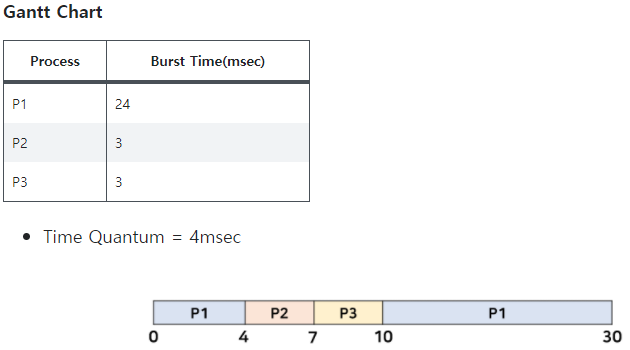

# CPU Scheduling

#### **`CPU 스케줄링 알고리즘`**

- CPU가 하나의 프로세스 작업을 끝내고 다음 프로세스로 어떤 프로세스를 선택할지 결정하는 알고리즘
- CPU 스케줄링 알고리즘은 현재 진행중인 프로세스가 종료 또는 I/O (대기상태로 변경)될 때까지 다른 프로세스가 **CPU를 강제 점유할 수 있느냐 없느냐**에 따라 **`Preemptive`** vs **`Non-preemptive`** 로 나뉨

- 알고리즘 종류
  - FCFS
  - SJF (Shortest-Job-First)  `non-preemptive`
  - SRJF (Shortest-Remaining-Time-First)  `preemptive`
  - Priority
  - RR (Round Robin)
  - Multilevel Queue
  - Multilevel Feedback Queue

 

### Preemptive vs Non-preemptive

#### `Preemptive`

프로세스가 CPU를 점유하고 있을 때 프로세스 종료나 I/O, 인터럽트가 발생하지 않아도 다른 프로세스가 CPU를 강제 점유(선점)할 수 있음

 

#### `Non-preemptive`

프로세스가 CPU를 점유하고 있을 때 종료, I/O 발생 전까지 다른 프로세스가 CPU를 점유할 수 없음

 

### 알고리즘 비교

| Preemptive                | Non-preemptive | both     |
| ------------------------- | -------------- | -------- |
| RR                        | FCFS           | priority |
| SRJF                      | SJF            |          |
| Multi-level Queue         |                |          |
| Multilevel Feedback Queue |                |          |

 

### `FCFS` (First-Come First-Served)

- **`프로세스의 도착 순서대로`** cpu를 점유한다.
- 먼저 도착한 작업의 cpu burst가 길고 뒤의 작입이 cpu burst가 짧으면, 대기시간이 길어져서 비효율 적이다.

### `SJF` (Shortest-Job-First)

 

- 하나의 스케쥴링이 종료된 후, ready queue에 있는 프로세스 중 cpu를 가장 짧은 시간만을 사용할 것으로 예측되는 프로세스가 cpu를 점유한다.
- 비선점(Nonpreemtive)으로서 중도에 cpu를 빼앗기지 않는다.
- 비선점으로 인하여 FCFS와 마찬가지로 작업 중인 프로세스의 cpu burst가 길면, 기다리는 cpu의 대기시간이 길어질 수 있다.

### `SRTF` (Shortest-Remaining-Time-First, Preemptive SJF)

- SJF의 문제를 해소하기 위하여, 선점(Preemptive)으로 작동한다.
- ready queue에 새로운 프로세스가 진입할 때마다, 프로세스의 예상 작업 시간과 진행 중인 프로세스의 남은 작업시간을 비교하여, 기다리는 프로세스의 시간이 짧으면 문맥 교환을 한다.
- 대기시간에 있어서만큼은 Optimal(최적화)를 보장한다.
- SJF와 SRTF의 공통적인 문제점은 Starving(기아) 현상에 있다. CPU Burst가 긴 작업은 다른 짧은 시간의 작업에 밀려서, 극단적인 상황에서는 cpu를 전혀 사용하지 못할 수도 있다.
- CPU Burst의 시간은 과거의 CPU burst 시간을 통해 예측한다. 그것은 Exponential Averaging이란 계산식을 통해 도출한다. 이 계산식은 최근의 작업시간을 그 전의 작업 시간보다 더 많이 고려하여 예상 시간을 도출하는 방식을 가진다.

### Priority Scheduling

- 우선순위 priority number를 각각의 프로세서에 할당한다. 높은 우선 순위(숫자가 낮을 수록)의 프로세서에 우선적으로 cpu를 할당한다.
- SJF, SRTF도 일종의 우선순위 스케줄링이다. CPU Burst Time을 우선순위로 두기 때문에.
- Starving(기아 현상)이 발생할 수 있다. SJF와 마찬가지로 우선순위가 낮은 프로세스가 전혀 cpu를 점유하지 못하는 경우가 발생할 수 있다.
- 해결책으로 **`Aging`**을 우선순위에 반영한다. 기다리는 시간이 길 수록, 우선순위를 점차 높히는 방식이다.

### RR Round Robin

- 현대에 가장 많이 사용하는 스케줄링 방식이다. (Time sharing)
- 각 프로세스 마다 동일한 크기의 할당시간time quantum을 가진다(일반적으로 10-100 milliseconds).
- 할당 시간이 지나면 선점(prrempted) 당하며 ready queue의 제일 마지막에 배치된다.
- 응답시간이 짧다. 응답시간이 (할당 시간)X(queue ready 프로세서)를 초과하지 않는다. 응답시간이 짧은 작업(I/O burst)이 많을 경우 유리하다.
- 반대로 Cpu Burst가 긴 작업에는 불리하다. ready queue에 있는 프로세서의 작업 시간이 길면, cpu 점유 시간을 조금씩만 나눠서 할당되기 때문에, 그만큼 작업이 모든 작업의 terminated 되기 까지의 시간이 길어진다. 10개의 프로세스가 동일하게 100초가 필요로 하면, 1000초 후에 모든 프로세스가 동시에 종료될 것이다.
- 할당 시간이 길면 : FCFS와 같아짐. 먼저 도착한 것이 먼저 끝나게 된다.
- 할당 시간이 짧으면 : 문맥 교환으로 인한 오버헤드가 과도하게 발생한다.

### Multilevel Queue

- Ready Queue를 여러 개로 분할하고, 각각의 queue의 우선순위를 정하고, 각각의 프로세스는 해당 프로세스의 우선 순위에 따라 각각의 queue에 배치되고, queue 간 경쟁을 통해 하나의 queue가 cpu를 점유하는 형태.
- foreground 큐와 background 큐로 분할. 전자는 interactive하며 cpu burst가 짧은 queue로서 우선 순위가 높다. 후자는 batch 등 긴 시간을 필요로 하는 작업이다.
- 각 queue마다 사용하는 스케줄링 알고리즘이 다르다. foreground의 경우 RR 방식, Backgournd의 경우 FCFS를 사용한다.
- Queue 간의 시간 점유 시간의 격차가 크면 클수록 기아 현상이 일어날 가능성이 높다. 그러므로 Time Slice를 통해 각 큐의 CPU time을 적절하게 할당해야 한다.

### Multilevel Feedback Queue

- Multilevel queue의 경우 queue와 프로세스에 대한 우선순위를 정해야 하고, queue의 time slice를 하는 등, 구현 방법이 복잡하다.
- Multilevel Feedback Queue의 경우 Aging 형태와 유사. 모든 작업은 Q0(그림으로는 quantum = 8)로부터 시작한다. 그리고 8만큼 시간 동안 작업을 하여도 끝나지 않은 작업은 Q1(사진 상 16)으로 옮겨진다. Q1에서 해당 프로세스를 진행해도 끝나지 않으면 Q2(FCFS)로 이동한다.
- 알고리즘에 따라 Q2가 Q1으로 이동할 수 있다