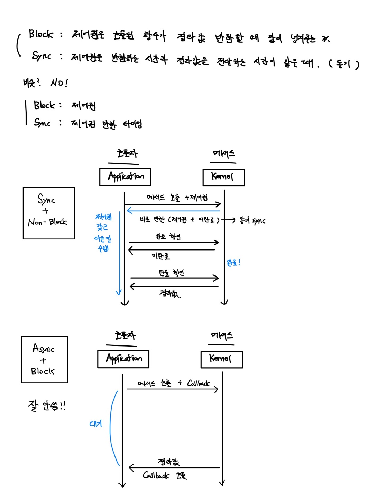

# 동기, 비동기, 블락, 논블락

<br>

## 동기 vs 비동기 (Synchronous / Asynchronous)

> 호출되는 함수의 작업 완료 여부를 누가 신경쓰고 있는지에 따라 다름


### `동기 방식`

> 하나의 작업이 끝나는 동시에 다른 작업이 시작하는 방식
>
> 동기는 함수를 호출하고 호출된 함수의 작업이 완료된 후의 return 을 기다리거나
> return 을 받더라도 **호출한 함수가 계속해서 작업완료 여부를 신경씀**

```javascript
// 동기적 코드
console.log('1');
console.log('2');
console.log('3');
/* 출력 결과
1
2
3
*/
```

<br>

### `비동기 방식`

> 두 주체가 서로의 시작, 종료시간과는 관계 없이 별도의 수행 시작/종료시간을 가지고 있음
>
> 동기는 함수를 호출할 때 `callback` 함수를 같이 전달해 작업이 완료되면 callback을 실행
> **작업완료를 callback이 신경씀**

```js
// 비동기적 코드
function foo() {
  console.log('1');
}
 
setTimeout(foo, 2000); // 비동기적 API
console.log('2');
console.log('3');
/* 출력 결과
2
3
1
*/
```

<br>

<br>

### `block, non-Block`

제어할 수 없는 대상의 처리 방법

제어권 : 행동할 수 있는 권리?

#### `block`

> 호출된 함수가 자신의 작업을 모두 끝낼때까지 제어권을 가지고 있어 호출한 함수가 대기하도록 만듦

#### `non-block`

> **호출된 함수가 바로 return**해 호출한 함수에게 제어권 넘기고 다른 일 할 수 있게 함
>
> 호출된 함수는 별개로 작업 수행 (단일 스레드 분할이나 다른 스레드에서 별도로 돌아감)
>
> 그럼 호출된 함수가 다 끝났을 때 결과는?
>
> - **`callback`** 함수로 들어감





