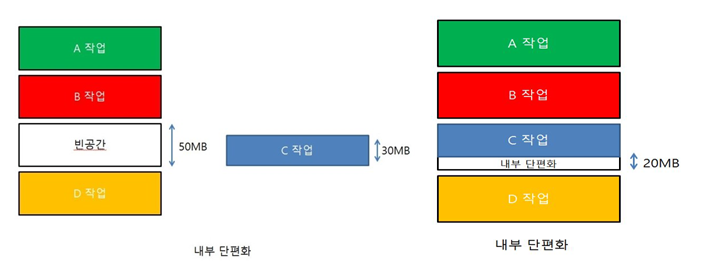

# 메모리계층

> CPU가 메모리에 더 빨리 접근할 수 있도록 메모리를 여러가지 종류로 나눈 계층 구조 

- 레지스터와 캐시는 CPU 내부에 존재
- 메모리는 CPU 외부에 존재. 접근이 느림
- 하드디스크는 CPU 직접 접근 불가능
  - 하드디스크에 접근하려면 HDD 데이터를 메모리로 이동시키킨 후 메모리에서 접근해야 함
  - 아주 느림
- 참조의 지역성
  - 자주 쓰이는 데이터는 계속 쓰임

### 각 계층의 설명

- 레지스터
  - 컴퓨터 프로세서 내에 자료를 보관
  - 아주 빠름
  - 일반적으로 현재 계산중인 값을 저장

 

- 캐시
  - 메인메모리에서 가장 자주 사용되는 위치의 데이터를 보관
  - 크기는 작으나 빠름
  - 프로세서가 MM에 접근할 때, 먼저 그 주소에 해당하는 데이터가 캐시에 있는지 살피게 됨
  - 캐시에 있으면 갖다 쓰거나 읽고, 없으면 그 때서야 MM에 접근

 

- 주기억장치 (메인메모리)
  - CPU에서 직접 접근이 가능한 메모리
  - 대표적으로 RAM, ROM이 존재
    - **RAM (Random Access Memory)** : 임의접근 기억장치
      - 사용자가 자유롭게 내용을 읽고 쓰고 지울 수 있음
      - 전원이 꺼지면 사라지는 **휘발성 메모리**
    - **ROM (Read Only Memory)**
      - 쓰기가 불가능한 읽기전용 메모리
      - 전원이 꺼져도 지워지지 않는 **비휘발성 메모리**
      - 플래시 메모리 : 비휘발성 반도체 저장장치. ROM의 일종. ex_USB, microSD 카드

 

- 보조기억장치 (2차기억장치)
  - CPU에서 접근 불가능한 메모리
  - SSD, HDD, CD 등이 존재

 

 

## 내부단편화, 외부단편화

 

### 내부단편화

> 메모리의 빈 공간에 신규 프로세스가 적재되었을 때, 
>
> 메모리에 잔여 공간이 남아 있음에도 너무 작아 다른 작업에서 사용하지 못하는 현상

### 외부단편화

> 신규 작업이 메모리에 적재될 수 있는 공간이 있음에도
>
> 받아들이지 못하는 현상

#### 단편화 해결방안 : **`압축`**

> **압축**
>
> 메모리의 빈 공간들을 모아서 큰 공간으로 만드는 기법

 

 

## 가상메모리

> **실제 메모리 크기와 상관없이** 메모리를 이용할 수 있도록 가상의 메모리 주소를 사용하는 방법
>
> ex) **페이징**(paging), **세그멘테이션**(segmentation)

**페이징(Paging)**

페이징 기법(paging)은 가상기억장치를 모두 같은 크기의 블록으로 편성하여 운용하는 기법

- 가상 메모리를 크기가 일정한 블록으로 나눈다.(PAGE)
- 물리 메모리도 같은 크기의 블록으로 나누어 (프레임) 각각을 할당한다.
- 고정된 크기의 프레임을 사용하므로 전부 사용되지 않으면 내부 단편화가 발생한다.

**세그멘테이션(Segmentation)**

페이징 기법에서는 가상 메모리를 같은 크기의 블록으로 분할했으나 세그멘테이션 기법에서는 가상 메모리를 서로 크기가 다른 논리적 단위인 세그먼트(Segment)로 분할하고 메모리를 할당하며 주소 변환

- 페이징은 프로세스를 물리적으로 일정한 크기로 나눠서 메모리에 할당하였다. 반면에 세그먼테이션은 프로세스를 논리적 내용(code, data, stack)을 기반으로 나눠서 메모리에 배치하는 것을 말한다.
- 가상 메모리를 일정한 크기가 아니라 메모리에 따라 크기가 다른 세그먼트로 분할한다.
- 각 크기에 맞는 물리 메모리 공간에 맞추어 할당한다.
- 할당/제거가 반복되면 빈 공간들이 발생하여 외부 단편화가 발생한다.

# 요구페이징, 가상메모리

### 가상 메모리

> 프로세스 전체가 메모리 내에 올라오지 않더라도  실행 가능하도록 하는 기법, 가상 메모리는 물리 메모리부터 사용자 관점의 논리 메모리를 분리시켜 주 메모리를 균일한 크기의 저장 공간으로 구성된 엄청나게 큰 배열로 추상화 시켜준다.

- 현재 사용하지 않은 데이터를 빼내어 가상 메모리에 저장해두고, 실제 메모리에선 처리만 하게 하는 것이 가상 메모리의 역할이다. **요구 페이징 기법과 스와핑**으로 구현.
- 장점
  - 사용자 프로그램이 물리 메모리보다 커져도 된다.
  - 각 사용자  프로그램이 더 작은 메모리를 차지하므로 더 많은 프로그램을 동시에 수행할 수 있다.
  - 프로그램을 메모리에 올리고 스왑하는데 필요한 입/출력 횟수가 줄어든다.
  - 가상메모리 파일의 공유를 쉽게 해주고 공유 메모리 구현을 가능하게 한다.
  - 프로세스 생성을 효율적으로 처리할 수 있는 메커니즘도 제공한다.
- 단점
  - 구현이 어렵고, 잘못 사용 시 성능이 현저히 저하 될 수 있다.

 

### 요구 페이징

> 프로세스의 이미지를 Backing Store에 저장한다. Backing Store는 swap device로 하드웨어의 부분인데 페이지를 임시로 보관하는 공간이다. 프로세스는 페이지의 조합이기 때문에 필요한 페이지만 메모리에 올린다.

- 페이징 기법을 사용 할 때 페이지 테이블을 작성한다. MMU의 재배치 레지스터를 통해 논리 주소를 물리 주소로 바꾸어주는 주소 변환 과정을 거쳐 CPU가 프로세스는 연속적으로 할당 되어져 있다고 속게 만드는 작업을 한다. 이걸 요구 페이징 기법을 사용하면 페이지가 메모리에 올라와있는 것도 있고 올라가지 않는 Backing Store에 보관되어 있는 것도 존재한다. 그래서 페이지 테이블을 작성할 때 이를 구분해 줄 도구로 유효한 비트 필드를 페이지 테이블에 추가해서 0과 1로 메모리에 저장되어 있는지 없는지 구분할 수 있다.
- 유효한 비트 필드를 통해 CPU에서 해당 메모리를 가져오라고 논리 주소를 보냈는데 페이지 테이블에서 접근하려는 페이지가 메모리에 있는지 없는지 알 수 있다.
- 페이지 부재 : 페이지가 있다면 Backing Store에서 해당 페이지를 가져온다. 이걸 수행하려면 CPU는 하던 작업을 멈추고 운영체제가 나서서 Backing Store를 뒤져 필요한 페이지를 메모리에 저장하고 유효한 비트 필드를 바꿔준다. 이런 현상을 페이지 부재라고 한다.
- 종류
  - 순수 요구 페이징 : 처음부터 모든 페이지를 적재시키지 않고 CPU가 요구할 때 유효 비트를 바꿔서 페이지를 저장하는 방법, 페이지를 요구할 때만 메모리에 저장하므로 메모리의 낭비는 줄일 수 있다. 하지만 요구에 의해 앞선 페이지 부재의 현상을 처리하려고 하면 많은 부담이 발생한다.
  - 프리페이징 : 우선 필요한 것 같은 페이지를 저장시키고 필요할 때 다른 페이지를 저장시키는 방법, 처리하는 속도는 빠르지만 메모리 낭비가 될 수 있다.
- 요구페이징은 현재 필요한 페이지만 메모리에 올리는 방식. 필요한 페이지가 메모리에 없다면 인터럽트 신호를 발생하여 디스크 내부에 있는 페이지를 메모리에 할당하는 작업을 한다. 가상 메모리와 같은 용어로 사용하는 경우가 많다. Swapping와 Demanding Paging의 공통점은 둘 다 메모리와 backing store(보조 기억) 사이를 서로 오고 가는 기능을 수행하지만, Swapping은 프로세스 단위로 이동하고 Demanding Paging은 페이지 단위로 이동하는 차이점이 있다.

