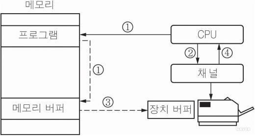
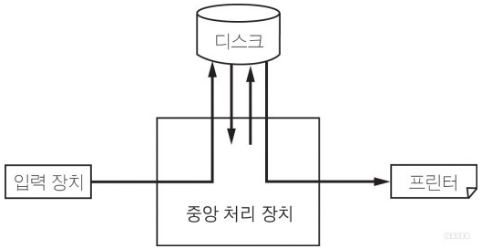

# 스풀링 버퍼링

> CPU의 처리속도와 입출력 장치의 속도 차이를 보완하기 위한 방법

 

### `버퍼링`

> 주기억장치의 일부, 버퍼메모리를 쓰는 H/W 일부의 기억장소
>
> 주로는 주기억장치의 일부를 버퍼메모리로 할당한 다음, 사용 예정 데이터를 임시로 저장
>
> - 장치 간 데이터를 주고 받을 때 처리속도를 완화하기 위한 기술

 

### `스풀링`

> 주로 프린트에서 사용
>
> 디스크 공간의 일정 부분을 활용해 데이터를 저장
>
> 디스크의 임시 저장 영역을 스풀(spool)이라 함

프린터는 하나의 프로세스가 프린팅을 수행하는 동안 다른 프로세스의 요청을 처리할 수 없음

그래서 추가 프린팅 작업에 필요한 **데이터를 디스크의 공간을 잡아서 버퍼링**을 해놓음

 

| 구분     |                 캐싱                 |               버퍼링                |                스풀링                |
| :------- | :----------------------------------: | :---------------------------------: | :----------------------------------: |
| 저장장치 |           고속 캐시(cache)           |             주기억장치              |           하드디스크(HDD)            |
| 목적     |  CPU와 입출력 장치 간 속도차이 보완  |                 ''                  |                  "                   |
| 사용용도 |                 CPU                  |            동영상, DBMS             |            프린터, 작업풀            |
| 자료구조 |                cache                 |            stack, queue             |                  _                   |
| 처리방식 |                 랜덤                 |                랜덤                 |                순차적                |
| 사용방식 | 단일 직업 계산,  단일 작업 입출력 | 단일 작업 계산, 단일 작업 입출력 | 다중 작업 계산,  단일 작업 입출력 |
| 구현방식 |                  HW                  |                 HW                  |                  SW                  |

