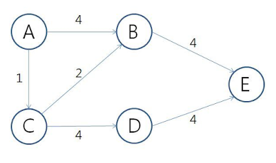

# 최단 경로 알고리즘

> ###### `주어진 그래프에서 두 정점을 연결하는 가장 짧은 경로의 길이를 찾는 알고리즘`
>
> 대표 알고리즘
>
> - 다익스트라 : 출발지/목적지가 정해져있고, 모든 가중치가 0 이상인 경우
> - 벨만포드 : 출발지/목적지가 정해져있고, 음수가중치가 있는 경우
> - 플로이드-와샬 : 모든점에서 출발해 모든점으로 가는 최단경로

<br>

## 다익스트라

> ###### `모든 정점 v에 대해 시작점 s에서 v까지의 최단 거리를 D[v]에 저장하며 작동`
>
> `동작 순서`
>
> 1. 현재 선택한 정점(처음엔 시작점)에 곧장 연결되고, 아직 방문하지 않은 정점들을 모두 본다.
>
> 2. 선택한 정점과 보고있는 정점 사이의 거리와 시작 정점과 선택한 정점까지의 최단거리의 합이 현재까지 구한 시작 정점과 보고 있는 정점 사이의 거리보다 짧을 경우, 이를 갱신해준다.
>
> 3. 1, 2번 수행이 모두 끝난 이후, 아직 방문하지 않은 정점들 중 시작점과의 거리가 가장 짧은 정점을 선택한다.
>
> 4. 방문하지 않은 정점이 존재하여 정점을 선택했다면, 현재 구한 시작점으로부터의 현재 선택한 정점 사이의 거리는 최단거리이다.
>
> 5. 방문하지 않은 정점이 존재하지 않는다면, 수행을 종료한다. 그렇지 않으면 1번으로 돌아가 수행을 반복한다.
>
> O(M*N)

#### 다익스트라 구현 방법

- 일반 큐(Queue)
  - 인접한 미방문 노드를 차례로 방문
  - 속도 : O(n2)
- 우선순위 큐(Priority Queue)
  - 최소거리로 정렬된 순서로 큐에서 추출
  - 일반 큐보다 갱신 횟수에서 더 효율적
  - 속도 : O(nlogn)



방문순서

- 일반큐         : A -> B -> C -> E -> B -> D -> E -> E

- 우선순위 큐 : A -> C -> B -> B -> D -> E -> E -> E

A -> B로 갈때

일반큐는 A -> B 거리값 4를 먼저 넣고 A -> C -> B 로 가는 거리값 3으로 갱신하게 되지만

우선순위큐는 A -> C -> B로 가는 거리값을 먼저 넣기 때문에 갱신횟수가 더 적다.

<br>

## 벨만-포드 알고리즘

> **그래프 내에 음수 가중치를 갖는 간선이 있는 경우**에도 활용 가능
>
> **경로 중에 음수 사이클이 존재하는 경우를 피해 최단 거리를 계산** 가능
>
> - 인접 정점을 검사하고 거리값 갱신하는 과정을 V-1번으로 제한 (V = 정점의 개수)
>
> 동작순서
>
> 1. 시작 정점을 결정한다.
> 2. 시작 정점부터 다른 정점까지 거리 값 모두 무한대로 초기화한다. (시작 정점은 0으로 초기화)
> 3. 현재 정점의 모든 인접 정점들을 탐생하며, 기존에 기록된 인접 정점까지의 거리보다 현재 정점을 거쳐 인접 정점에 도달하는 거리가 더 짧다면 인접 정점까지의 거리를 갱신한다.
> 4. 3번 과정을 *V*−1번 반복한다.
> 5. 위 과정을 모두 마친 후에도 거리가 갱신되는 경우가 있다면 그래프에 음수 사이클이 존재한다는 것을 알 수 있다.
>
> 시간복잡도 : O(M * N) * N

<br>

## 플로이드-와샬

> 모든 정점 사이의 최단경로를 구할 수 있다
>
> 시간복잡도 : O(V^3)
>
> D[i][j] = (정점 i로부터 정점 j로의 최단거리)
>
> D[i][j] = min(D[i][j], D[i][k] + D[k][j]) (1 <= k <= V)

```java
for(k = 1; k <= V; k++){
    for(i = 1; i <= V; i++){
        for(j = 1; j <= V; j++){
            D[i][j] = min(D[i][j], D[i][k] + D[k][j]);
        }
    }
}
```


