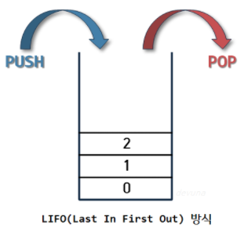
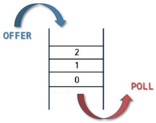

# 스택(Stack) vs 큐(Queue)

> 자료구조에서 가장 기본적이면서 알고리즘에 사용되는 자료형

 

### 스택(Stack)

> LIFO(Last In First Out) : 후입선출 방식

#### `특징`

- 같은 구조와 크기의 자료를 정해진 방향으로만 쌓을 수 있음
- top이 가르키는 메모리주소에만 접근 가능
- top : 가장 최근 들어온 자료의 메모리주소
- push & pop 을 통해 삽입/삭제 연산 수행

#### `활용 예시`

- 웹페이지 뒤로가기
- 실행 취소(Undo)
- 후위표기법
- 수식의 괄호 검사
- DFS (그래프 탐색)

 

 

### 큐(QUEUE)

> FIFO (First In First Out) : 선입선출 방식

#### `특징`

- 프론트(front)에서 삭제(deQueue) 연산, 리어(rear)에서 삽입(enQueue) 연산
- 원소는 rear로 들어오고 front로 빠져나감
- 가장 늦게 큐에 들어온 원소가 가장 마지막으로 나감

#### `활용 예시`

- 프린터
- 은행 업무
- 콜센터
- BFS
- 캐시(Cache)