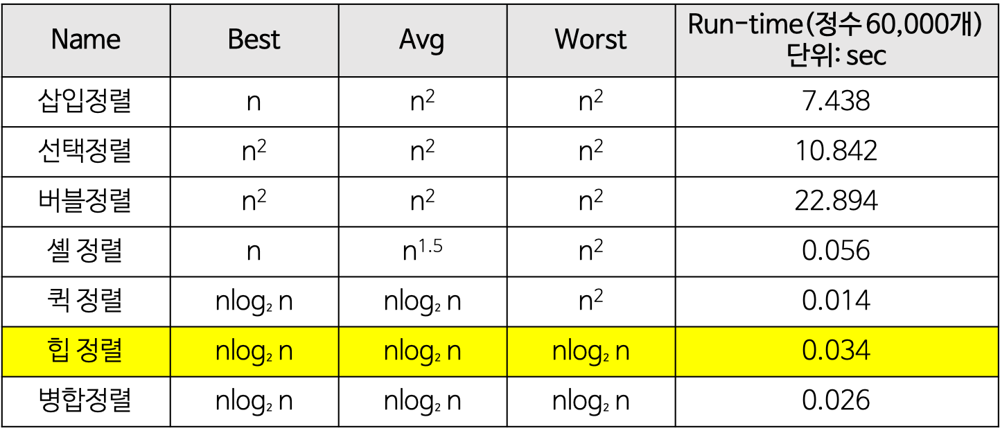

# 정렬 알고리즘

병합정렬은 공간복잡도가 크고 메모리 많이 사용 -> 잘 안씀

퀵정렬이 가장 좋다 - 현재 sort() 함수는 다 퀵정렬로 구현

 

**힙 정렬(heap sort) 알고리즘의 특징**

장점 

- 시간 복잡도가 좋은편 
- 힙 정렬이 가장 유용한 경우는 전체 자료를 정렬하는 것이 아니라 가장 큰 값 몇개만 필요할 때 이다.

 

**퀵 정렬 알고리즘의 특징**

장점 

- 속도가 빠르다. 
- 시간 복잡도가 O(nlog₂n)를 가지는 다른 정렬 알고리즘과 비교했을 때도 가장 빠르다. 
- 추가 메모리 공간을 필요로 하지 않는다. 
- 퀵 정렬은 O(log n)만큼의 메모리를 필요로 한다.

단점 

- 정렬된 리스트에 대해서는 퀵 정렬의 불균형 분할에 의해 오히려 수행시간이 더 많이 걸린다. 
- 퀵 정렬의 불균형 분할을 방지하기 위하여 피벗을 선택할 때 더욱 리스트를 균등하게 분할할 수 있는 데이터를 선택한다.

